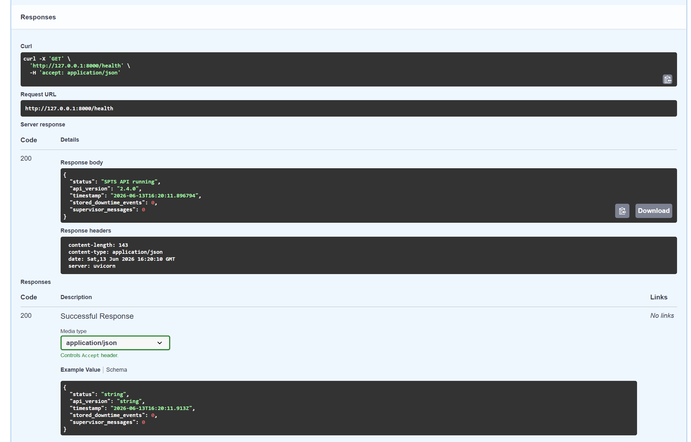
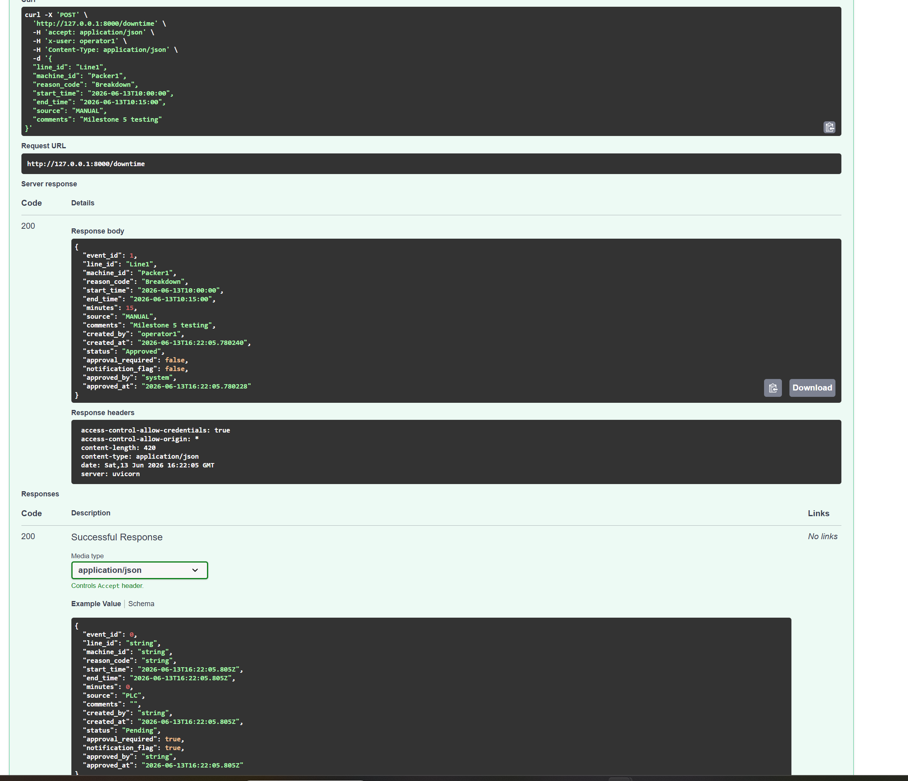
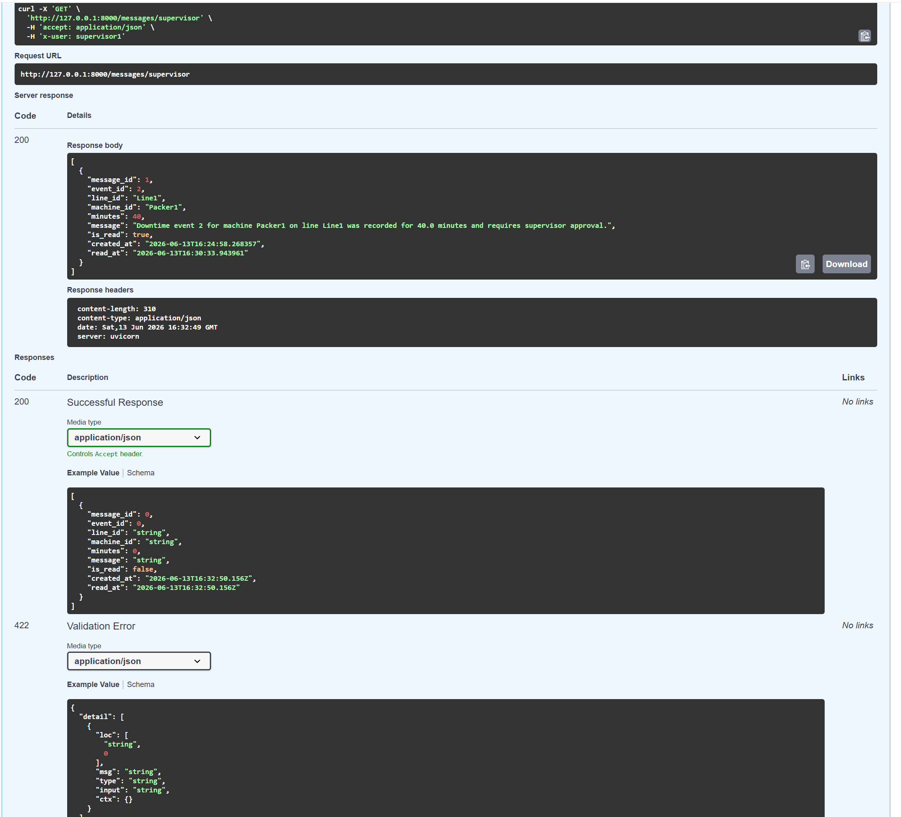
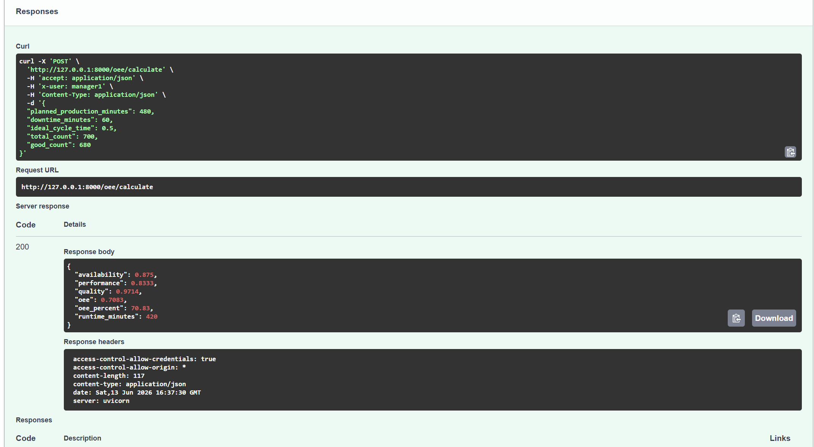
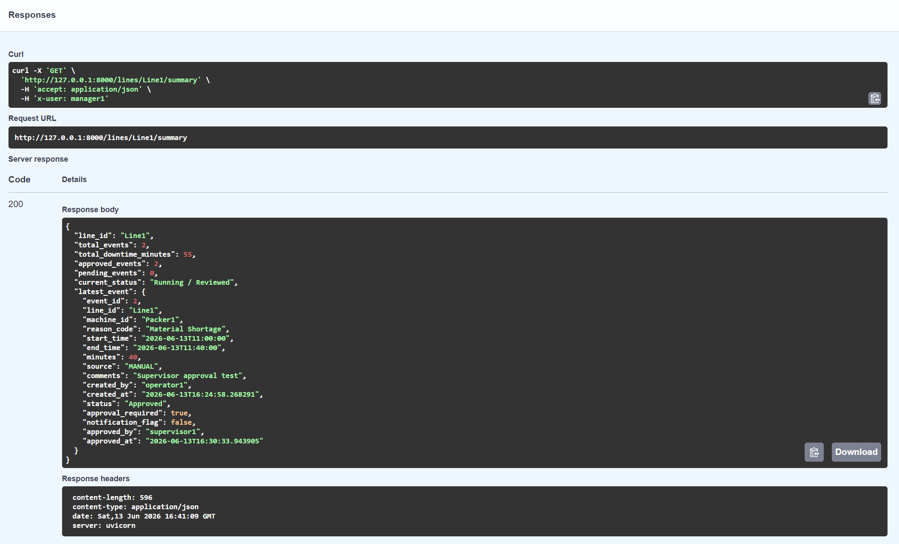
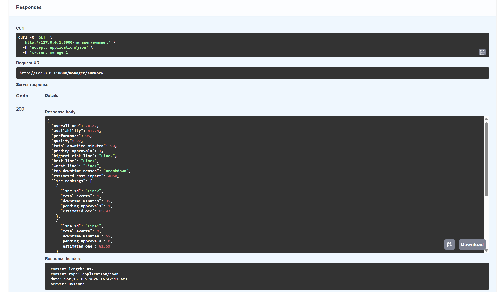

# 🏭 Smart Production Tracking System (SPTS)


---

## 📖 Overview

The **Smart Production Tracking System (SPTS)** is a full-stack manufacturing production monitoring application built with **FastAPI, Python, HTML, CSS, and JavaScript**.

The system simulates a real manufacturing environment where production operators record downtime events, supervisors review and approve production interruptions, and managers monitor Overall Equipment Effectiveness (OEE) and production performance through role-based dashboards.

The goal of the project is to demonstrate how modern manufacturing software can automate production workflows, improve operational visibility, reduce downtime, and support data-driven decision making.

---

# ✨ Features

## 🏭 Production Monitoring

- Record production downtime events
- Automatic downtime duration calculation
- Production line monitoring
- Downtime history
- Manufacturing workflow validation

---

## ✅ Workflow Automation

- Automatic approval for downtime events **25 minutes or less**
- Supervisor approval required for downtime events **greater than 25 minutes**
- Pending approval queue
- Supervisor notification system
- Approval workflow management

---

## 🛡 Data Validation

- Prevent overlapping downtime events
- Validate start and end times
- Automatic downtime calculations
- Input validation
- Business rule enforcement

---

## 📊 Performance Analytics

- Overall Equipment Effectiveness (OEE)
- Production summary by line
- Manager KPIs
- Supervisor KPIs
- Downtime reporting

---

## 👥 Role-Based Dashboards

### 👷 Production Dashboard

Production operators can:

- Record downtime
- Monitor production status
- Submit manufacturing events

---

### 👨‍💼 Supervisor Dashboard

Supervisors can:

- Review pending downtime
- Approve production events
- View supervisor notifications
- Monitor approval activity
- Review production KPIs

---

### 👨‍💼 Manager Dashboard

Managers can:

- Review production KPIs
- Monitor OEE
- Analyze production summaries
- View manufacturing performance

---

# 📸 Application Screenshots

## Home Page


---

## Production Dashboard


---

## Supervisor Dashboard


---

## Manager Dashboard


---

## Health Endpoint



---

## Downtime Event Created



---

## Pending Supervisor Approval


---

## Supervisor Approval


---

## Supervisor Messages



---

## PLC Simulation


---

## OEE Calculation



---

## Line Summary API



---

## Manager Summary API



---

# 🛠 Technology Stack

| Category | Technology |
|-----------|------------|
| Backend | FastAPI |
| Programming Language | Python |
| Frontend | HTML5 |
| Styling | CSS3 |
| Client Logic | JavaScript |
| API Documentation | Swagger UI |
| Architecture | REST APIs |
| Version Control | Git & GitHub |

---

# 📂 Project Structure

```text
spts-capstone
│
├── app/
│   ├── main.py
│   └── ...
│
├── frontend/
│   ├── index.html
│   ├── line.html
│   ├── supervisor.html
│   ├── manager.html
│   ├── script.js
│   └── style.css
│
├── screenshots/
│
├── README.md
├── requirements.txt
└── .gitignore
```

---

# 🚀 Getting Started

## Clone the repository

```bash
git clone https://github.com/Shnnsl/spts-capstone.git
```

## Navigate to the project

```bash
cd spts-capstone
```

## Install dependencies

```bash
pip install -r requirements.txt
```

## Start the application

```bash
uvicorn app.main:app --reload
```

Open the API documentation:

```
http://127.0.0.1:8000/docs
```

---

# 🔌 Available API Endpoints

| Endpoint | Description |
|----------|-------------|
| `/health` | API health check |
| `/downtime` | Create and retrieve downtime events |
| `/downtime/pending` | View pending approvals |
| `/downtime/{id}/approve` | Approve downtime events |
| `/messages/supervisor` | Supervisor notification messages |
| `/lines/{line_id}/summary` | Production line summary |
| `/oee/calculate` | Calculate Overall Equipment Effectiveness |
| `/plc/simulate` | Simulate PLC production events |

---

# 📋 Current Business Rules

The application automatically enforces the following production rules:

- Downtime events **25 minutes or less** are automatically approved.
- Downtime events **greater than 25 minutes** require supervisor approval.
- Overlapping downtime events for the same machine are rejected.
- Invalid production times are rejected.
- Supervisor notifications are automatically generated when approval is required.

---

# 🚧 Future Improvements

- User authentication and authorization
- PostgreSQL database integration
- WebSocket real-time dashboard updates
- Raspberry Pi sensor integration
- PLC hardware connectivity
- SAP / ERP integration
- Manufacturing IoT support
- Production reporting exports
- Automated unit and integration testing
- Cloud deployment

---

# 🎯 Project Objectives

This project demonstrates practical software engineering concepts including:

- Full-stack web application development
- REST API design
- Manufacturing workflow automation
- Production monitoring
- Software validation
- Dashboard development
- Business rule implementation
- Version control using Git and GitHub

---

# 📄 License

This project is licensed under the MIT License.

---

⭐ If you found this project interesting, please consider giving it a star!
